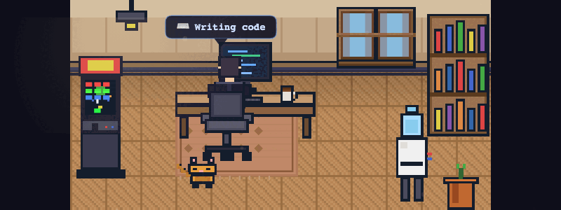

# agent-arcade

[](https://opensource.org/licenses/MIT)
[](https://www.typescriptlang.org/)

A living pixel art office that watches your Cursor AI agent work — and lets you interact with the world while you wait.

```
Install → Open bottom panel → Watch your agent type, read, and celebrate
Click the coffee mug. Grow the plant. Toggle the lights. Tap the arcade cabinet.
```

> Cursor-native. 27KB. No paid assets. No setup. Just install and go.



## Install

### From VSIX (current)

```bash
git clone https://github.com/ofershap/agent-arcade.git
cd agent-arcade
npm install && npm run build
npx @vscode/vsce package --allow-star-activation
cursor --install-extension agent-arcade-0.1.0.vsix
```

### From Marketplace (coming soon)

Search "Agent Arcade" in the Cursor extensions panel.

## What It Does

Your AI agent appears as a pixel character sitting at a desk in a tiny office. The character's behavior mirrors what the agent is actually doing — typing when editing code, reading when inspecting files, celebrating when a task completes.

The office is interactive. Click objects and things happen:

| Object | Interaction |
|--------|-------------|
| Coffee mug | Steam rises, satisfying micro-animation |
| Plant | Grows through 3 stages on repeated clicks |
| Lamp | Toggles room lighting (dim/bright mode) |
| Whiteboard | Displays the agent's current activity |
| Arcade cabinet | Easter egg — tap it 3 times |

## How It Works

The extension watches Cursor's agent transcript files (`~/.cursor/projects/<workspace>/agent-transcripts/`) and infers what the agent is doing from the text of its responses. No API hooks, no control layer — purely observational.

## Development

```bash
npm install
npm run build       # one-time build
npm run watch       # watch mode
```

Build produces two bundles via esbuild:
- `dist/extension.js` — VS Code extension host (Node.js)
- `dist/webview.js` — Canvas 2D webview (browser)

## Tech

- Vanilla TypeScript + Canvas 2D (no React, no game engine)
- All sprites hardcoded as pixel color arrays — zero external asset dependencies
- esbuild for both bundles
- 27KB packaged VSIX

## License

MIT
